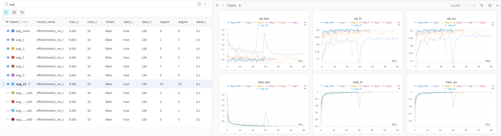
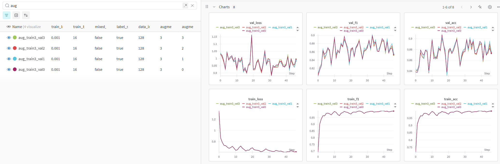
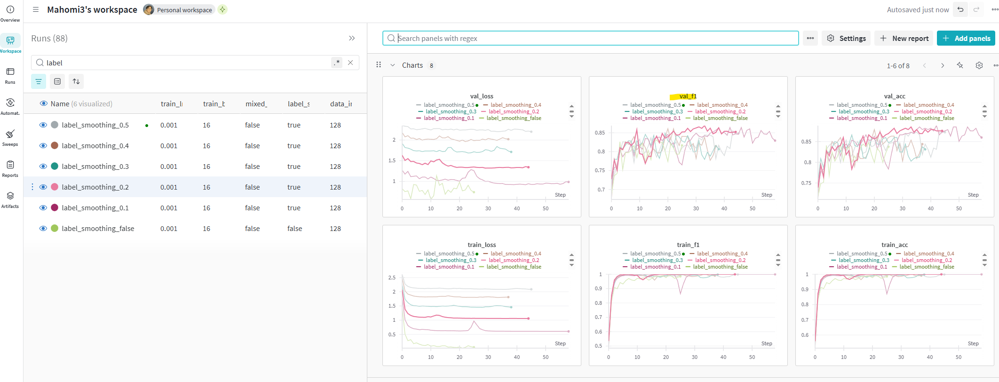

## 훈련 데이터 증강 개수에 따른 성능 변화
이미지당 증강 개수에 따른 스코어 변화 공유합니다. 9배,10배 부터 비슷해지는듯합니다

## 검증 데이터 증강 개수에 따른 성능 변화
훈련 데이터 이미지당 증강3개, 검증 데이터 이미지당 증강 0~3개 테스트해봤는데 (0은 증강안함), 검증 데이터 증강 개수를 바꿔도 val_f1 스코어에 변화가 별로 없었습니다. 검증 데이터는 증강을 하지 않아도 되는것으로 보입니다

## 라벨 스무딩
라벨 스무딩을 0.1 ~ 0.2 정도 적용했을때 검증데이터 f1스코어 그래프가 적용안했을때 보다 안정화 되는거 같습니다.

## 증강시 파일 저장 방식
- 이미지를 증강할때 {imgname}_aug{num}.jpg 과 같은 형식으로 증강하여 원본이미지를 알 수 있게끔 증강함, 이로인해 train/valid 데이터셋 분리시에도 증강된 이미지를 구분가능.
- 이때 {imgname}_aug{num}.pt와 같이 transform된 Tensor를 .pt로 저장하여, 프로그램에서 읽어올때는 .jpg가 아닌 .pt 파일을 읽어오도록 하여 성능개선.

## Hydra 및 wandb 적용
- 다양한 파라미터를 yaml로 관리 (모델종류, 학습률, 배치사이즈, 에폭, 이미지사이즈, 증강개수, holdout/kfold 여부, 시드앙상블 등)
- 프로그램 실행시, 다양한 컨피그 및 설정 가능
- 다양한 실행 결과를 wandb에 저장하여 관리
